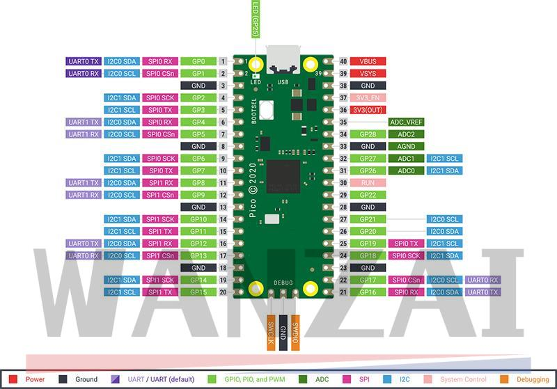
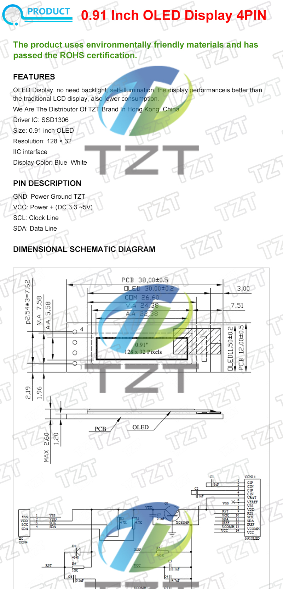

# rpi-pico

Raspberry PI Pico projects

## Getting started

[Raspberry PI Documentation](https://www.raspberrypi.com/documentation/microcontrollers/micropython.html)

## Preparing development environment in ArchLinux

### Dependencies

Packages and SDK are in AUR repositories, therefore you need a tool such as pikaur to install them:

```bash
$pikaur -S openocd-picoprobe pico-sdk openocd-picoprobe picotool python3-pip
$pip install rshell # As root

```

Visual Studio Code extensions

```bash
$code --install-extension ms-python.python
$code --install-extension visualstudioexptteam.vscodeintellicode
$code --install-extension ms-python.vscode-pylance
$code --install-extension paulober.pico-w-go
```

Environment variables

```bash
export PICO_SDK_PATH=/usr/share/pico-sdk
```

### Archlinux: Grant non-root access to openocd

Link: [Setting up Raspberry Pi Pico development with picoprobe in VSCode on Arch Linux](https://areed.me/posts/2021-05-09_setting_up_raspberry_pi_pico_development_in_vscode_on_arch_linux/)

By default, openocd will fail to connect to the picoprobe-flashed Pico unless it is run as root. This can be fixed by creating a udev rules file for openocd in /etc/udev/rules.d. When I installed openocd-picoprobe it did provide a rules file, /usr/lib/udev/rules.d/60-openocd.rules, that could be copied into the correct directory. However, I found that there were a couple of issues with this - the most significant one being that, at the time of writing, it contained no entry for picoprobe. The other entries in this file also made use of the plugdev group, which is apparently obsolete. After some testing I found that the following rule file entry was sufficient to grant non-root USB access for openocd on my machine, without having to create or modify any user groups:

Get the device idVendor and idProduct

```bash

$lsusb                                                                                                                           
Bus 006 Device 001: ID 1d6b:0003 Linux Foundation 3.0 root hub
Bus 005 Device 003: ID 046d:c332 Logitech, Inc. G502 Proteus Spectrum Optical Mouse
Bus 005 Device 002: ID 1038:1622 SteelSeries ApS SteelSeries Apex 3 TKL
Bus 005 Device 001: ID 1d6b:0002 Linux Foundation 2.0 root hub
Bus 004 Device 001: ID 1d6b:0003 Linux Foundation 3.0 root hub
Bus 003 Device 001: ID 1d6b:0002 Linux Foundation 2.0 root hub
Bus 002 Device 001: ID 1d6b:0003 Linux Foundation 3.0 root hub
Bus 001 Device 012: ID 2e8a:0005 MicroPython Board in FS mode
Bus 001 Device 001: ID 1d6b:0002 Linux Foundation 2.0 root hub
```

Add the udev rule

```bash

# /etc/udev/rules.d/60-openocd.rules 
# Raspberry Pi Picoprobe
ATTRS{idVendor}=="2e8a", ATTRS{idProduct}=="0004", TAG+="uaccess"

```

Note: It might be necessary to add your user to the ttyAMC0 device:

```bash
$ ll /dev/ttyAMC0
crw-rw----+ 1 root uucp 166, 0 ago 16 10:55 /dev/ttyACM0
# As root
$ usermod -aG $USER uucp
```

## Hardware

### Micro controler

[Article link](https://www.aliexpress.com/item/1005004005660504.html)

Official Raspberry Pi Pico Board RP2040 Dual-Core 264KB ARM Low-Power Microcomputers High-Performance Cortex-M0+ Processor
Specification:

- RP2040 microcontroller chip designed by Raspberry Pi in the United Kingdom
- Dual-core Arm Cortex M0+ processor, flexible clock running up to 133 MHz
- 264KB of SRAM, and 2MB of on-board Flash memory
- Castellated module allows soldering direct to carrier boards
- USB 1.1 with device and host support
- Low-power sleep and dormant modes
- Drag-and-drop programming using mass storage over USB
- 26 × multi-function GPIO pins
- 2 × SPI, 2 × I2C, 2 × UART, 3 × 12-bit ADC, 16 × controllable PWM channels
- Accurate clock and timer on-chip
- Temperature sensor
- Accelerated floating-point libraries on-chip
- 8 × Programmable I/O (PIO) state machines for custom peripheral support



### Display

[Article link](https://www.aliexpress.com/item/32850288143.html)

[Display: 0.91 inch OLED Display Module 128×32 SSD1306 GME12832-11 Interface IIC](https://goldenmorninglcd.com/oled-display-module/0.91-inch-128x32-ssd1306-gme12832-11/)



### Breadboard kit

[Article link](https://www.aliexpress.com/item/1005004480364105.html)

