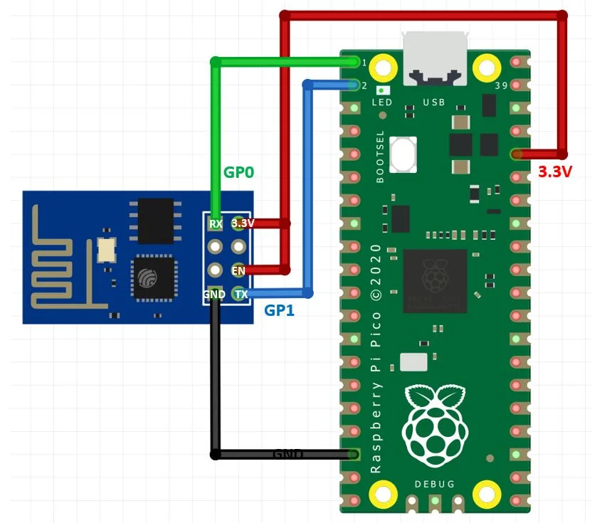

# ESPRESSIF ESP8266 

## User guide

Release v2.2.0.0

[Get Started](https://docs.espressif.com/projects/esp-at/en/release-v2.2.0.0_esp8266/Get_Started/index.html)

## esptool

[A Python-based, open-source, platform-independent utility to communicate with the ROM bootloader in Espressif chips.](https://github.com/espressif/esptool)


## Raspberry Pico Web Server

[Source: Microcontrollers Lab](https://microcontrollerslab.com/esp8266-wifi-module-raspberry-pi-pico-web-server/)

### Raspberry Pi Pico UART Pins


|UART Pins| GPIO Pins  |
|---------|------------|
|UART0-TX|GP0/GP12/GP16|
|UART0-RX|GP1/GP13/GP17|
|UART1-TX|GP4/GP8|
|UART1-RX|GP5/GP9|


### Connection diagram



|Raspberry Pi Pico|ESP-01|
|-----------------|------|
|3.3V|VCC|
|3.3V|EN|
|GND|GND|
|GP1 (UART0 RX)|TX|
|GP0 (UART0 TX)|RX|

### Raspberry Pi Pico Web Server MicroPython Script

```python
import uos
import machine
import utime

recv_buf="" # receive buffer global variable

print()
print("Machine: \t" + uos.uname()[4])
print("MicroPython: \t" + uos.uname()[3])

uart0 = machine.UART(0, baudrate=115200)
print(uart0)

def Rx_ESP_Data():
    recv=bytes()
    while uart0.any()>0:
        recv+=uart0.read(1)
    res=recv.decode('utf-8')
    return res

def Connect_WiFi(cmd, uart=uart0, timeout=3000):
    print("CMD: " + cmd)
    uart.write(cmd)
    utime.sleep(7.0)
    Wait_ESP_Rsp(uart, timeout)
    print()

def Send_AT_Cmd(cmd, uart=uart0, timeout=3000):
    print("CMD: " + cmd)
    uart.write(cmd)
    Wait_ESP_Rsp(uart, timeout)
    print()
    
def Wait_ESP_Rsp(uart=uart0, timeout=3000):
    prvMills = utime.ticks_ms()
    resp = b""
    while (utime.ticks_ms()-prvMills)<timeout:
        if uart.any():
            resp = b"".join([resp, uart.read(1)])
    print("resp:")
    try:
        print(resp.decode())
    except UnicodeError:
        print(resp)
    
Send_AT_Cmd('AT\r\n')          #Test AT startup
Send_AT_Cmd('AT+GMR\r\n')      #Check version information
Send_AT_Cmd('AT+CIPSERVER=0\r\n')      #Destroy TCP/IP server
Send_AT_Cmd('AT+RST\r\n')      #Reset ESP-01 module
Send_AT_Cmd('AT+RESTORE\r\n')  #Restore Factory Default Settings
Send_AT_Cmd('AT+CWMODE?\r\n')  #Query the WiFi mode
Send_AT_Cmd('AT+CWMODE=1\r\n') #Set the WiFi mode = Station mode
Send_AT_Cmd('AT+CWMODE?\r\n')  #Query the WiFi mode again
#Send_AT_Cmd('AT+CWLAP\r\n', timeout=10000) #List available APs
Connect_WiFi('AT+CWJAP="HUAWEI-u67E","4uF77R2n"\r\n', timeout=5000) #Connect to AP
Send_AT_Cmd('AT+CIFSR\r\n')    #Obtain the Local IP Address
utime.sleep(3.0)
Send_AT_Cmd('AT+CIPMUX=1\r\n')    #Obtain the Local IP Address
utime.sleep(1.0)
Send_AT_Cmd('AT+CIPSERVER=1,80\r\n')    #Obtain the Local IP Address
utime.sleep(1.0)
print ('Starting connection to ESP8266...')
while True:
    res =""
    res=Rx_ESP_Data()
    utime.sleep(2.0)
    if '+IPD' in res: # if the buffer contains IPD(a connection), then respond with HTML handshake
        id_index = res.find('+IPD')
        print("resp:")
        print(res)
        connection_id =  res[id_index+5]
        print("connectionId:" + connection_id)
        print ('! Incoming connection - sending webpage')
        uart0.write('AT+CIPSEND='+connection_id+',200'+'\r\n')  #Send a HTTP response then a webpage as bytes the 108 is the amount of bytes you are sending, change this if you change the data sent below
        utime.sleep(1.0)
        uart0.write('HTTP/1.1 200 OK'+'\r\n')
        uart0.write('Content-Type: text/html'+'\r\n')
        uart0.write('Connection: close'+'\r\n')
        uart0.write(''+'\r\n')
        uart0.write('<!DOCTYPE HTML>'+'\r\n')
        uart0.write('<html>'+'\r\n')
        uart0.write('<body><center><h1>Raspberry Pi Pico Web Server</h1></center>'+'\r\n')
        uart0.write('<center><h2>Microcontrollerslab.com</h2></center>'+'\r\n')
        uart0.write('</body></html>'+'\r\n')
        utime.sleep(4.0)
        Send_AT_Cmd('AT+CIPCLOSE='+ connection_id+'\r\n') # once file sent, close connection
        utime.sleep(2.0)
        recv_buf="" #reset buffer
        print ('Waiting For connection...')
```
